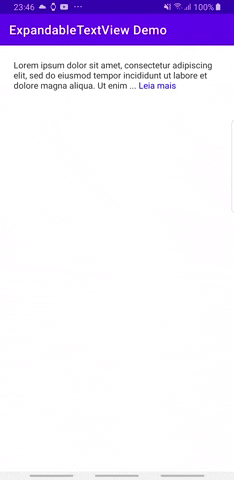

# ExpandableTextView

[](https://search.maven.org/artifact/com.github.edsergeev.expandabletextview/expandabletextview/1.0.2/aar)
[](https://appetize.io/app/vg9evd5u6zc9bfpuj89wzd24tg)
[](https://opensource.org/licenses/MIT)

An Expandable TextView for Android written in
[Kotlin](https://kotlinlang.org/). The main ideia was study how create a library in Android and deploy
on [Maven Central Repository](https://s01.oss.sonatype.org).


## Table of Contents

- [Demo project](#demo-project)
- [Getting started](#getting-started)
- [Usage](#usage)
  - [Supported features](#supported-features)
- [Documentation](#documentation)
- [Contributing](#contributing)
- [License](#license)
- [Acknowledgments](#acknowledgments)

## Demo Project

Take a look at the [demo project](app).



## Getting Started

Add it in your root build.gradle at the end of repositories:
```
allprojects {
  repositories {
    ...
    maven { url 'https://jitpack.io' }
  }
}
```
Add the dependency
```kotlin
dependencies {
    implementation 'com.github.edsergeev.expandabletextview:expandabletextview:$LatestVersion'
}
```
Current latest version is: [](https://jitpack.io/#EdSergeev/ExpandableTextView)


## Usage

* collapsedLines -> number of visible lines
* isExpanded -> state of textview (default is false)
* animationDuration -> duration of the animation in ms (Will be implemented in a future version)
* readMoreText -> text to use instead of default ellipses
* readLessText -> text to use instead of default ellipses
* ellipsizeTextColor -> color of ellipsize text (Will be implemented in a future version)
* isUnderlined -> underline the ellipsize text (Will be implemented in a future version)

Then use `ExpandableTextView` just as you would use any other `TextView`.

Xml snippet:
```xml
<com.github.edsergeev.expandabletextview.ExpandableTextView
        android:id="@+id/expand_tv"
        android:layout_width="match_parent"
        android:layout_height="wrap_content"
        expandableTextView:collapsedLines="3"
        expandableTextView:animDuration="500"
        expandableTextView:readMoreText="Leia mais"
        expandableTextView:readLessText="Leia menos"
        expandableTextView:textMode="line"
        expandableTextView:isExpanded="true"
        android:text="@string/very_long_text" />
```


### Supported features
- Setting maximum number of collapsed lines via xml.
- Setting the ellipsized text via xml.
- Setting the collapsed text via xml.
- Setting if the text starts expanded or collapsed.

## Documentation
//TODO
Take a look at the library documentation with description of public functions and properties:


## Contributing

If you wish to send a pull request, please make sure to checkout from `main` branch and merge with `main` branch as well.

## License

This project is licensed under the MIT License - see the [LICENSE](LICENSE) file for details.

## Acknowledgments

This library was based on: [viewmore-textview](https://github.com/mike5v/viewmore-textview).
